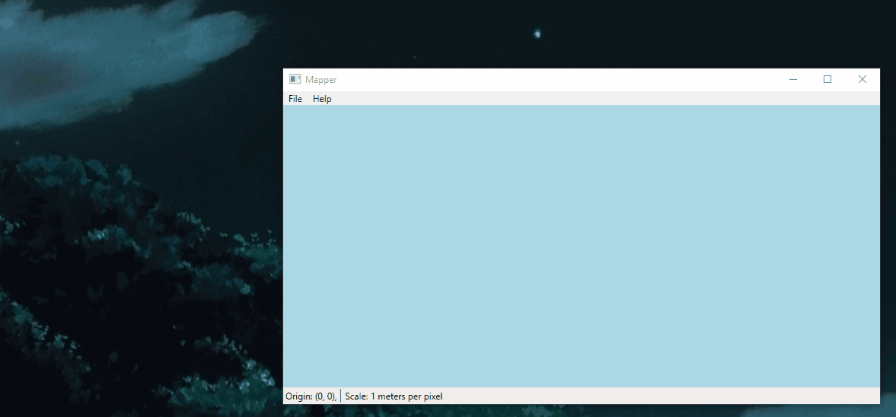
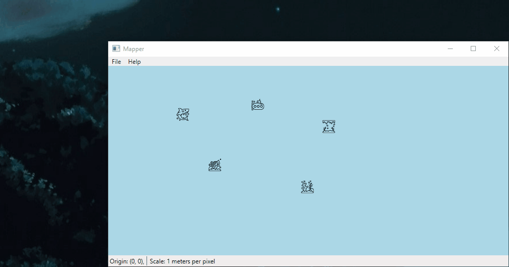
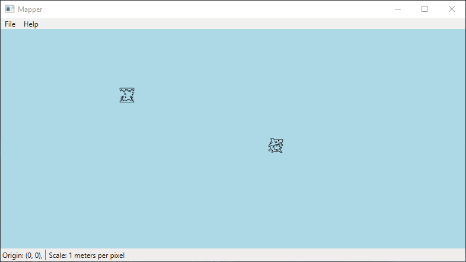
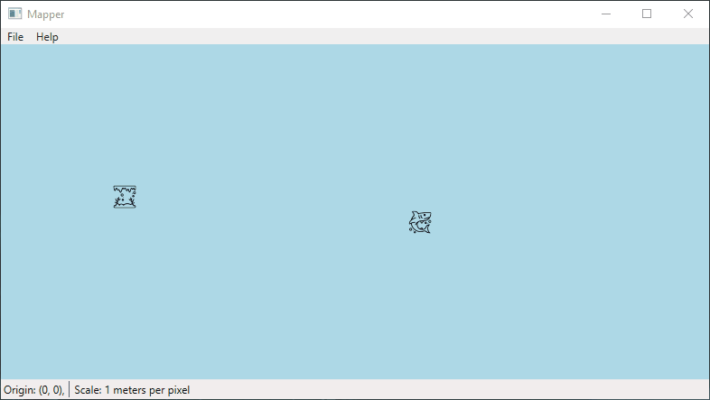
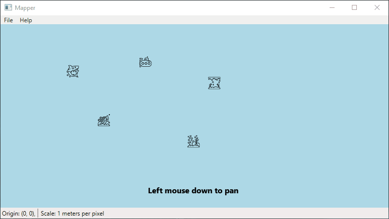

# Mapper

Mapper (name pending......) is an app where you can create your own map with markers. It also allows measuring the distance and direction between arbitrary positions on the map, to help you decide where the markers should go. I made this specifically as a tool for [Subnautica](https://unknownworlds.com/subnautica/), where there is no in-game map, but where you're often able to get the position and direction relative to a place of interest or placed beacon.

It should be pretty straight-forward to use. Launch the exe file, and check the Help > Controls to see the controls.

## Features

Features include:

- Pan and zoom
- Add, remove and edit named markers
- Move markers
- Measure distance and direction

Here are some of the features visualized:

  
Adding markers

  
  

  
Editing markers

  
  

  
Measuring

  
  

  
Moving a marker

  
  

  
Panning and zooming

  
  

## Contributing
The project should not be difficult to build, just start up the Mapper.sln file with Visual Studio Community 2019.

Dependencies are:
- [.NET 5.0](https://dotnet.microsoft.com/download/dotnet/5.0) (probably needs to be downloaded manually)
- WPF (activated with Visual Studio Installer feature ".NET desktop development")

And NuGet dependencies (should be downloaded automatically by Visual Studio):
- Newtonsoft.Json (for saving to and loading from file)

DISCLAIMER: This is my first WPF project. I've tried to stick with some kind of MVVM pattern, but it's probably a mess. You have been warned.

### Icons
The marker icons are from www.flaticon.com (see [Acknowledgments](#acknowledgments)), and they are pretty random. If you want to contribute by creating your own markers, they should be square icons made in a vector format (e.g. svg). They will need to be converted to a [DrawingImage](https://docs.microsoft.com/en-us/dotnet/api/system.windows.media.drawingimage?view=net-5.0) object, by using e.g. [SvgToXaml](https://github.com/BerndK/SvgToXaml), but if you reach out I can also help with that.

I will try to make loading of images more dynamic in the future, so you can just put svg images in a folder and they will be used automatically, but we're not there yet :)

### Name
The name feels very generic, if you have a suggestion feel free to tell me!

## Acknowledgments
Icons made by [Smashicons](https://www.flaticon.com/authors/smashicons) from www.flaticon.com.
